# Capstone Project - The Battle of Neighborhoods

[TOC]

This file, and other associated files, make up my contribution to the final Peer Reviewed Assignment for the Coursera Capstone Project for Applied Data Science Capstone. This was my final module in the [IBM Data Science Professional Certificate](https://www.coursera.org/specializations/ibm-data-science-professional-certificate) programme.

For reference I include the original definition for each part of the assignment.

# Section 1: Introduction

In this section I will clearly define the idea of my choosing, where I leverage the Foursquare location data to solve the imagined business opportunity. 

## Background

There are 100's, maybe even 1000's, of travel sites on the Internet, including [FourSquare](www.foursquare.com), that will tell you all about places to go, things to see, restaurants to eat at, bars to drink in, nightclubs to part the night away in and then where to go in the morning to get breakfast and a strong coffee. The problems with these sites is that they are one dimensional. If you want to find out all this information about a city you plan to visit next month, **you** have to do the hard work. Also, just because a venue is the hottest place to go for a night out does not always mean that the unwitting tourist should just ramble in unprepared. The areas surrounding this new venue might be riddled with crime including muggings, car theft and assault, for example. Approach the venue from any direction other than from the north and you could be putting your life in danger. This is when my idea comes in.

Imagine the following scenario:

1. You like to plan ahead and always review your options and make your choices about where you will visit and eat up front before you travel. 
2. You are flying to Chicogo for a Data Science Conference.
3. You arrive in Chicago the day the conference starts but you've managed to convince your boss to delay your return by a few days giving you time to explore.
4. But you know no one in Chicago to show you around to all the top sites and to bring you to the best restaurants.
5. Also the last time you went to a conference you were mugged and had you passport. money and credit cards stolen so you're now nervous of going somewhere without first researching the venue and the surrounding area.
6. The conference is next week and you don't have time to do all the research you'd like.

**What do you do ... ?**

## Project Idea

My idea for the Capstone Project is to show that when driven by venue and location data from FourSquare, backed up with open source crime data, that it is possible to present the cautious and nervous traveller with a list of attractions to visit supplementd with a graphics showing the occurance of crime in the region of the venue.

A high level approach is as follows:

1. The travellers decides on a city location [in this case Chicago]
2. The ForeSquare website is scrapped for the top venues in the city
3. From this list of top venues the list is augmented with additional grographical data
4. Using this additional geographical data the top nearby restaurents are selects
5. The historical crime within a predetermined distance of all venues are obtained
6. A map is presented to the to the traveller showing the selected venues and crime statistics of the area. 
7. The future probability of a crime happening near or around the selected top sites is also presented to the user

#### Who is this solution targeted at

This solution is targeted at the cautious traveller. The want to see all the main sites of a city that they have never visited before but at the same time, for whatever reaons unknown, they want to be able to do all that they can to make sure that they stay clear of trouble i.e. is it safe to visit this venue and this restaurant at 4:00 pm in the afternoon.

Some examples of envisioned users include:

* A single white female traveller
* An elderly traveller that has had previous back experiences when travelling

There are many data science aspect of this project including:

1. Data Acquisition
2. Data Cleansing
3. Data Analysis
4. Machine Learning
5. Prediction

Now that the conference is over the Data Sceintist can explore Chigago and feel much safer.


# Section 2: Data

## Data Description

In this section, I will describe the data used to solve the problem as described previously. 

As noted below in the Further Development Section, it is possible to attempt quite complex and sophisticated scenarios when approaching this problem. However, given the size of the project and for simplicity only the following scenario will be addressed:

1. Query the FourSqaure website for the top sites in Chicago
2. Use the FourSquare API to get supplemental geographical data about the top sites
3. Use the FourSquare API to get top restaurent recommendations closest to each of the top site 
4. Use open source Chicago Crime data to provide the user with additional crime data

## Top Sites from FourSquare Website

Although FourSquare provides a comprehensive API, one of the things that API does not easily support is a mechanism to directly extract the top N sites / venues in a given city. This data, however, is easily available directly from the FourSquare Website. To do this simply go to www.foursquare.com, enter the city of your choise and select Top Picks from _I'm Looking For_ selection field.

Using BeautifulSoup and Requests the results of the Top Pick for Chicago was retrieved. A sample venue is shown below:

```html
<div class="venueDetails">
    <div class="venueName">
        <h2>
    <a href="/v/millennium-park/42b75880f964a52090251fe3" target="_blank">Millennium Park
    </a>
</h2>
    </div>
    <div class="venueMeta">
        <div class="venueScore positive" style="background-color: #00B551;" title="9.7/10 - People like this place">9.7</div>
        <div class="venueAddressData">
            <div class="venueAddress">201 E Randolph St (btwn Columbus Dr &amp; Michigan Ave), Chicago</div>
            <div class="venueData"><span class="venueDataItem"><span class="categoryName">Park</span><span class="delim"> • </span></span>
            </div>
        </div>
    </div>
</div>
```

From this HTML the following data can be extracted:

* Venue Name
* Venue Score
* Venue Category 
* Venue HREF
* Venue ID [Extracted from the HREF]

A sample of the extracted data is given below:

| id                       | score | category      | name                         | href                                              |
| ------------------------ | ----- | ------------- | ---------------------------- | ------------------------------------------------- |
| 42b75880f964a52090251fe3 | 9.6   | Park          | Millennium Park              | /v/millennium-park/42b75880f964a52090251fe3       |
| 4b9d15c5f964a520478e36e3 | 9.5   | Waterfront    | Chicago Riverwalk            | /v/chicago-riverwalk/4b9d15c5f964a520478e36e3 |
| 4b06c066f964a52097ef22e3 | 9.5   | Liquor Store  | Binny's Beverage Depot       | /v/binnys-beverage-depot/4b06c066f964a52097ef22e3 |
| 4f2a0d0ae4b0837d0c4c2bc3 | 9.5   | Deli / Bodega | Publican Quality Meats       | /v/publican-quality-meats/4f2a0d0ae4b0837d0c4c... |
| 4c23e840a852c928594ae26c | 9.5   | Trail         | Nature Boardwalk             | /v/nature-boardwalk/4c23e840a852c928594ae26c   |

We will have a closer look at this data gather later on when the supplemental geographical data has been added.

## Supplemental Geographical Data

Using the `id` field extracted from the HTML it is then possible to get further supplemental geographical details about each of the top sites from FourSquare using the following sample API call:

```python
# Get the properly formatted address and the latitude and longitude
url = 'https://api.foursquare.com/v2/venues/{}?client_id={}&client_secret={}&v={}'.format(
    venue_id, 
    cfg['client_id'],
    cfg['client_secret'],
    cfg['version'])
    
result = requests.get(url).json()
result['response']['venue']['location']
```
The requests returns a JSON object which can then be queried for the details required. The last line in the sample code above returns the following sample JSON:

```json
{  
   "city":"Chicago",
   "lng":-87.62323915831546,
   "crossStreet":"btwn Columbus Dr & Michigan Ave",
   "neighborhood":"The Loop",
   "postalCode":"60601",
   "cc":"US",
   "formattedAddress":[  
      "201 E Randolph St (btwn Columbus Dr & Michigan Ave)",
      "Chicago, IL 60601",
      "United States"
   ],
   "state":"IL",
   "address":"201 E Randolph St",
   "lat":41.8826616030636,
   "country":"United States"
}
```

From this the following attributes are extracted:

* Venue Address

* Venue Postalcode

* Venue City

* Venue Latitude

* Venue Longitude

   

## Final FourSquare Top Sites Data

A sample of the final FourSquare Top Sites data is shown below:

| id                       | score | category      | name                         | address                 | postalcode | city    | href                                              | latitude  | longitude  |
| ------------------------ | ----- | ------------- | ---------------------------- | ----------------------- | ---------- | ------- | ------------------------------------------------- | --------- | ---------- |
| 42b75880f964a52090251fe3 | 9.6   | Park          | Millennium Park              | 201 E Randolph St       | 60601      | Chicago | /v/millennium-park/42b75880f964a52090251fe3       | 41.882662 | -87.623239 |
| 4b9d15c5f964a520478e36e3 | 9.5   | Waterfront         | Chicago Riverwalk      | Chicago River | 60611      | Chicago | /v/chicago-riverwalk/4b9d15c5f964a520478e36e3 | 41.887280 | -87.627217 |
| 4b06c066f964a52097ef22e3 | 9.5  | Liquor Store    | Binny's Beverage Depot | 1720 N. Marcey St.      | 60614      | Chicago | /v/binnys-beverage-depot/4b06c066f964a52097ef22e3 | 41.913076 | -87.648718 |
| 4f2a0d0ae4b0837d0c4c2bc3 | 9.5   | Deli / Bodega | Publican Quality Meats       | 825 W Fulton Market     | 60607      | Chicago | /v/publican-quality-meats/4f2a0d0ae4b0837d0c4c... | 41.886642 | -87.648718 |
| 4c23e840a852c928594ae26c | 9.5   | Trail       | Nature Boardwalk          | 2001 N Clark St          | 60607      | Chicago | /v/nature-boardwalk/4c23e840a852c928594ae26c   | 41.918102 | -87.633283 |
#### Data Analysis and Visualisation

An initial look at the data shows that there are 30 rows of data [as expected] each with 10 attributes. The variable types are all correct except the Venue Rating or Score which will be converted to a float. After converting the score column to a float it can clearly be seen that we have the top venues with a mean of `9.44`.

```python
df_top_venues.shape
(30, 10)

df_top_venues.dtypes
id             object
score          object
category       object
name           object
address        object
postalcode     object
city           object
href           object
latitude      float64
longitude     float64
dtype: object
    
df_top_venues.score.describe()
count    30.000000
mean      9.440000
std       0.067466
min       9.300000
25%       9.400000
50%       9.400000
75%       9.500000
max       9.600000
Name: score, dtype: float64
```


We are now ready to get the top restaurents within 500 meters of each of the top sites.

## FourSquare Restaurent Recommendation Data

Using the the list of all `id` values in the Top Sites DataFrame and the FourSquare `categoryID` that represents all food venues we now search for restaurants within a 500 meter radius.

```python
# Configure additional Search parameters
categoryId = '4d4b7105d754a06374d81259'
radius = 500
limit = 15

url = 'https://api.foursquare.com/v2/venues/search?client_id={}&client_secret={}&ll={},{}&v={}&categoryId={}&radius={}&limit={}'.format(
    cfg['client_id'],
    cfg['client_secret'],
    ven_lat,
    ven_long,
    cfg['version'],
    categoryId,
    radius,
    limit)

results = requests.get(url).json()
```
The requests returns a JSON object which can then be queried for the restaurant details required. A sample restaurnt from the results returned is shown below:

```json
{  
    "referralId":"v-1538424503",
    "hasPerk":"False",
    "venuePage":{  
        "id":"135548807"
    },
    "id":"55669b9b498ee34e5249ea61",
    "location":{  
        "labeledLatLngs":[  
            {  
                "label":"display",
                "lng":-87.62460021795313,
                "lat":41.88169538551873
            }
        ],
        "crossStreet":"btwn E Madison & E Monroe St",
        "postalCode":"60603",
        "formattedAddress":[  
            "12 S Michigan Ave (btwn E Madison & E Monroe St)",
            "Chicago, IL 60603",
            "United States"
        ],
        "distance":155,
        "city":"Chicago",
        "lng":-87.62460021795313,
        "neighborhood":"The Loop",
        "cc":"US",
        "state":"IL",
        "address":"12 S Michigan Ave",
        "lat":41.88169538551873,
        "country":"United States"
    },
    "name":"Cindy's",
    "categories":[  
        {  
            "pluralName":"Gastropubs",
            "id":"4bf58dd8d48988d155941735",
            "name":"Gastropub",
            "primary":"True",
            "icon":{  
                "prefix":"https://ss3.4sqi.net/img/categories_v2/food/gastropub_",
                "suffix":".png"
            },
            "shortName":"Gastropub"
        }
    ]
},
```
From this JSON the following attributes are extraced and added to the Dataframe:

- Restaurant ID
- Restaurant Category Name
- Restaurant Category ID
- Restaurant Nest_name
- Restaurant Address
- Restaurant Postalcode
- Restaurant City
- Restaurant Latitude
- Restaurant Longitude
- Venue Name
- Venue Latitude
- Venue Longitude

The only piece of data that is missing is the Score or Rating of the Restaurant. To get this we need to make another FourSquare API query using the id of the Restaurant:

```python
# Get the restaurant score and href
rest_url = 'https://api.foursquare.com/v2/venues/{}?client_id={}&client_secret={}&v={}'.format(
    rest_id, 
    cfg['client_id'],
    cfg['client_secret'],
    cfg['version'])

result = requests.get(rest_url).json()
rest_score = result['response']['venue']['rating']
```
Using just the data in this DataFrame we will be able to generate maps displaying the chosen Top List Venue and the best scored surrounding restaurants. A sample of this data is shown below:

| id                       | score | category        | categoryID               | name                      | address           | postalcode | city    | latitude  | longitude  | venue_name      | venue_latitude | venue_longitude |
| ------------------------ | ----- | --------------- | ------------------------ | ------------------------- | ----------------- | ---------- | ------- | --------- | ---------- | --------------- | -------------- | --------------- |
| 551192b1498e8695352d33e6 | 8.2   | American Restaurants      | 4bf58dd8d48988d155941735 | Remington's                   | 20 N Michigan Ave | 60602      | Chicago | 41.882628 | -87.624608 | Millennium Park | 41.882598      | -87.624126      |
| 4e73881c922e0a374024c7b8 | 7.5   | Coffee Shops   | 4bf58dd8d48988d16c941735 | Starbucks               | 8 N Michigan Ave | 60602    | Chicago | 41.882478 | -87.624701 | Millennium Park | 41.882598      | -87.624126      |
| 49e749fbf964a52086641fe3 | 8.9   | Gastropubs      | 4bf58dd8d48988d155941735 | The Gage                  | 24 S Michigan Ave | 60603      | Chicago | 41.881202 | -87.624642 | Millennium Park | 41.882598      | --87.624126      |
| 4ed3dd7e93ad987b5112d29f | 8.1   | Bakeries | 4bf58dd8d48988d143941735 | Panera Bread | 2 N Michigan Ave | 60602      | Chicago | 41.882228 | -87.624703 | Millennium Park | 41.882598     | -87.624126      |
| 4a63b5c3f964a5209fc51fe3 | 7.8   | Pizza Places            | 4bf58dd8d48988d11b941735 | Pizano's Pizza              | 61 E Madison St.  | 60603      | Chicago | 41.882031 | -87.625642 | Millennium Park | 41.882598      | -87.624126      |


Looking at the data we get an interesting insight into the range of restuarants that are included. From a list of 30 top venues only 11 actually had more than 10 to provide the user with a real choice. In total there were 406 restaurants found of which 238 were unique occuring only once in the data. There were 71 categories of restaurants. The mean score of all the restaurants wa `7.843596` with a manimum value of `9.5` and a minimum value of `5.2`.  

Coffee Shops (54) and Pizza Places (27) were the top two most frequently occurring categories but Delis / Bodegas (9.500000) were the restaurant categories with the highest average score.

```python
# What is the shape of the Restaurants DataFrame
df_restaurant.shape
(406, 13)

# Get a count of the top venues that had more than 10 restaurant within 500 meters
#  The number of unique restaurants
#  The number of unique restaurant categories
df_restaurant.venue_name.nunique()
11
df_restaurant.name.nunique()
238
df_restaurant.category.nunique()
71

# Look at the data types
df_restaurant.dtypes
id                  object
score              float64
category            object
categoryID          object
name                object
address             object
postalcode          object
city                object
latitude           float64
longitude          float64
venue_name          object
venue_latitude     float64
venue_longitude    float64
dtype: object
    
# Describe the Score attribute
df_restaurant.score.describe()
count    406.000000
mean       7.843596
std        0.910268
min        5.200000
25%        7.300000
50%        8.000000
75%        8.600000
max        9.500000
Name: score, dtype: float64
        
df_restaurant.groupby('category')['name'].count().sort_values(ascending=False)[:10]
category
Coffee Shops                54
Pizza Places                27
Donut Shops                 26
Italian Restaurants         20
Sandwich Places             18
American Restaurants        16
New American Restaurants    15
Bakeries                    14
Mexican Restaurants         12
Cafés                       12
Name: name, dtype: int64

df_restaurant.groupby('category')['score'].mean().sort_values(ascending=False)[:10]
category
Delis / Bodegas                     9.500000
Chocolate Shops                     9.400000
Southern / Soul Food Restaurants    8.900000
Molecular Gastronomy Restaurants    8.900000
Breweries                           8.833333
Music Venues                        8.800000
Gourmet Shops                       8.800000
Scandinavian Restaurants            8.800000
Brazilian Restaurants               8.800000
Salad Places                        8.780000
```


## Chicago Crime Data

This dataset can be download from the [Chicago Data Portal](https://data.cityofchicago.org/) and reflects reported incidents of crime (with the exception of murders where data exists for each victim) that occurred in the City of Chicago in the last year, minus the most recent seven days. A full desription of the data is available on the site.

Data is extracted from the Chicago Police Department's CLEAR (Citizen Law Enforcement Analysis and Reporting) system. In order to protect the privacy of crime victims, addresses are shown at the block level only and specific locations are not identified.

| Column Name           | Type        | Description                                                  |
| :-------------------- | :---------- | :----------------------------------------------------------- |
| CASE#                 | Plain Text  | The Chicago Police Department RD Number (Records Division Number), which is unique to the incident. |
| DATE OF OCCURRENCE    | Date & Time | Date when the incident occurred. this is sometimes a best estimate. |
| BLOCK                 | Plain Text  | The partially redacted address where the incident occurred, placing it on the same block as the actual address. |
| IUCR                  | Plain Text  | The Illinois Unifrom Crime Reporting code. This is directly linked to the Primary Type and Description. See the list of IUCR codes at https://data.cityofchicago.org/d/c7ck-438e. |
| PRIMARY DESCRIPTION   | Plain Text  | The primary description of the IUCR code.                    |
| SECONDARY DESCRIPTION | Plain Text  | The secondary description of the IUCR code, a subcategory of the primary description. |
| LOCATION DESCRIPTION  | Plain Text  | Description of the location where the incident occurred.     |
| ARREST                | Plain Text  | Indicates whether an arrest was made.                        |
| DOMESTIC              | Plain Text  | Indicates whether the incident was domestic-related as defined by the Illinois Domestic Violence Act. |
| BEAT                  | Plain Text  | Indicates the beat where the incident occurred. A beat is the smallest police geographic area – each beat has a dedicated police beat car. Three to five beats make up a police sector, and three sectors make up a police district. The Chicago Police Department has 22 police districts. See the beats at https://data.cityofchicago.org/d/aerh-rz74. |
| WARD                  | Number      | The ward (City Council district) where the incident occurred. See the wards at https://data.cityofchicago.org/d/sp34-6z76. |
| FBI CD                | Plain Text  | Indicates the crime classification as outlined in the FBI's National Incident-Based Reporting System (NIBRS). See the Chicago Police Department listing of these classifications at http://gis.chicagopolice.org/clearmap_crime_sums/crime_types.html. |
| X COORDINATE          | Plain Text  | The x coordinate of the location where the incident occurred in State Plane Illinois East NAD 1983 projection. This location is shifted from the actual location for partial redaction but falls on the same block. |
| Y COORDINATE          | Plain Text  | The y coordinate of the location where the incident occurred in State Plane Illinois East NAD 1983 projection. This location is shifted from the actual location for partial redaction but falls on the same block. |
| LATITUDE              | Number      | The latitude of the location where the incident occurred. This location is shifted from the actual location for partial redaction but falls on the same block. |
| LONGITUDE             | Number      | The longitude of the location where the incident occurred. This location is shifted from the actual location for partial redaction but falls on the same block. |
| LOCATION              | Location    | The location where the incident occurred in a format that allows for creation of maps and other geographic operations on this data portal. This location is shifted from the actual location for partial redaction but falls on the same block. |

Not all of the attributes are required so on the following data was imported:

* Date of Occurance
* Block
* Primary Description
* Ward
* Latitude
* Longitude

A sample of the imported data is shown.

| CASE#    | DATE  OF OCCURRENCE    | BLOCK                 | PRIMARY DESCRIPTION | WARD | LATITUDE  | LONGITUDE  |
| -------- | ---------------------- | ----------------------| ------------------- | ---- | --------- | ---------- |
| JC339338 | 07/08/2019 01:04:00 AM | 003XX S LARAMIE AVE   | OTHER OFFENSE       | 29.0 | 41.875527 | -87.754885 |
| JC368418 | 07/28/2019 05:00:00 AM | 017XX N HUMBOLDT BLVD | THEFT               | 1.0  | 41.912669 | -87.701942 |
| JC356571 | 07/19/2019 09:00:00 PM | 031XX W HARRISON ST   | OTHER OFFENSE       | 24.0 | 41.873699 | -87.704705 |
| JC405144 | 08/23/2019 11:00:00 PM | 019XX W SCHILLER ST   | THEFT               | 1.0  | 41.907177 | -87.675381 |
| JC379670 | 08/05/2019 12:30:00 PM | ST074XX S HARVARD AVE | BATTERY             | 6.0  | 41.759037 | -87.633299 |


This data was then processed as follows:

1. Move September 2017 dates to September 2018
   The extract of data used was taken mid September which meant that there was half a months data for September 2017 and half a months data for september 2018. These were combined to create a single month.
2. Clean up the column names:
   1. Strip leading & trailing whitespace
   2. Replace multiple spaces with a single space
   3. Remove # characters
   4. Replace spaces with _
   5. Convert to lowercase
3. Change the date of occurance field to a date / time object
4. Add new columns for:
   1. Hour
   2. Day
   3. Month
   4. Year
   5. etc.
5. Split Block into zip_code and street
6. Verify that all rows have valid data

#### Data Analysis and Visualisation

Now let's look at some of the attributes and statistics of the crime dataset.

We will start by looking at the top three crimes and a total count for each crime type:

```python
# What Crimes are the 3 most commonly occuring ones 
df[['primary_description', 'case']].groupby(
    ['primary_description'], as_index=False).count().sort_values(
    'case', ascending=False).head(3)
```

| primary_description | case  |
| ------------------- | ----- |
| THEFT               | 52465 |
| BATTERY             | 45332 |
| CRIMINAL DAMAGE     | 25651 |

To get a better understanding of the data we will now visualise it. The number of crimes per month, day and hour were calculated:

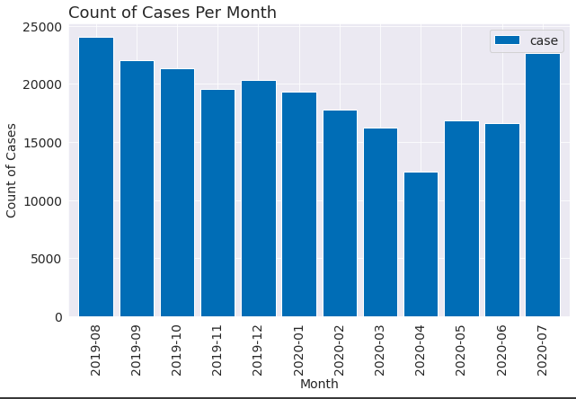

 

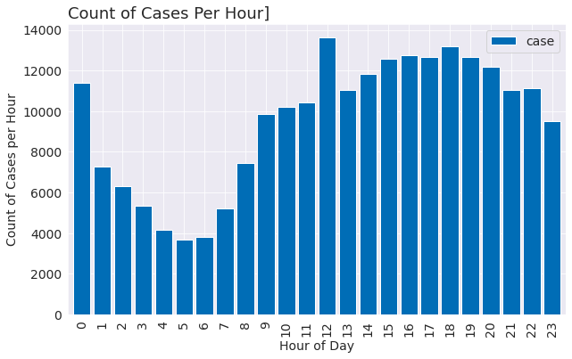

Looking at the top three crimes it is clearly visible that the occurances of theft rise gretly during daylight hours and particularly between the hours of 3:00 pm and 5:00 pm.

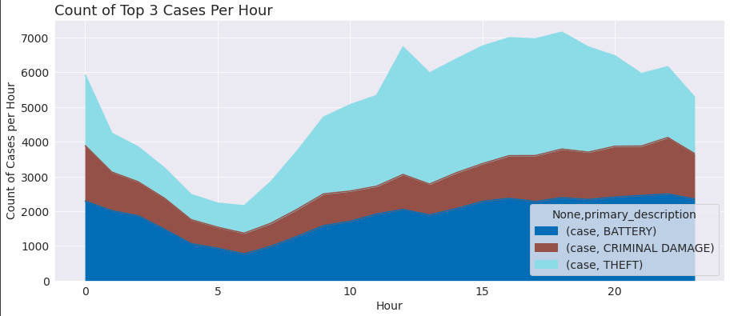


Unsuprisingly there little obvious variation in the number of crimes committed per month other than an apparent drop-off in February. There is a small increase in crime reported at the weekend, Saturday and
Sunday, but nothing that couldbe considered significant. There is an expected fall-off in reported crime rates after midnight and before eight in the morning.

Finally the crimes data for a single month, August, was super-imposed over a map of Chicago to visualise the distribution of that data:

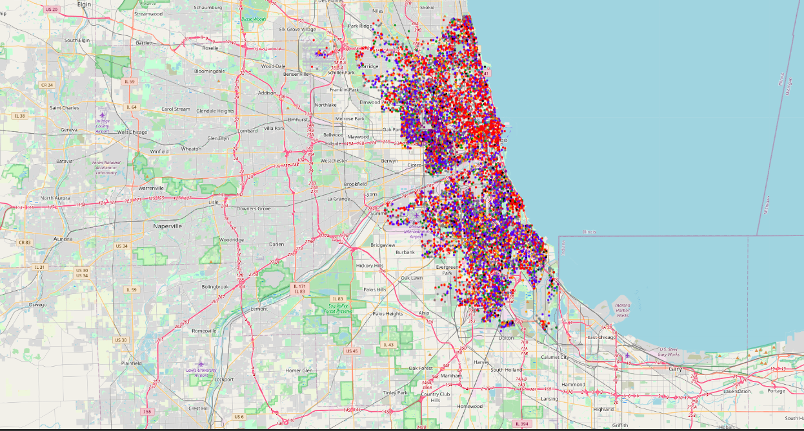

The higher frequency of the top two crimes can be easily seen. Red for Theft and Blue for Battery.

Next the crimes were clustered:

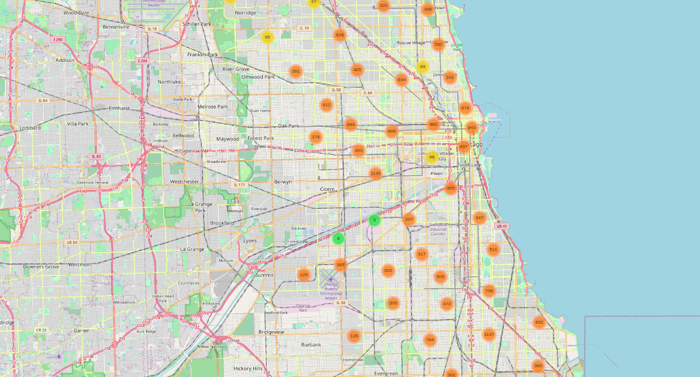

Several obvious clusters of crime locations were visible, particularly in the center of Chicago.

Finally a heat map of the August crimes was created:

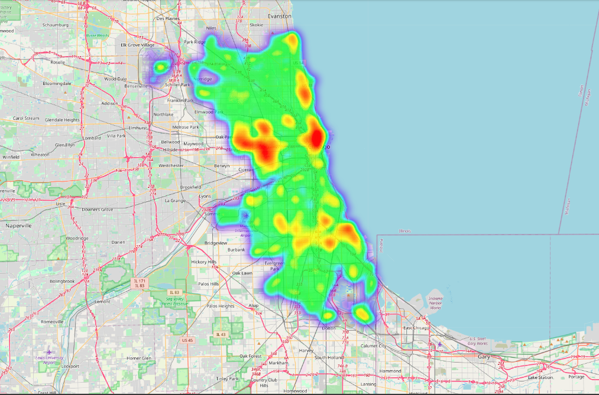

This reinforces the cluster chart where it can clearly be seen that the center of Chicago and the area around Oak Park have a high crime rate occurrence. It will be interesting to see later if there is a high probability of crime in these areas if one of the top listed venues are located in these areas.


# Section 3: Methodology

Methodology section which represents the main component of the report where you discuss and describe any exploratory data analysis that you did, any inferential statistical testing that you performed, and what 
machine learnings were used and why.

## Exploratory Data Analysis

The first round of eploratory analysis was to examine the Top Venues and Restaurants Dataframes to determine if there was any correlation between variables.

Unforfunately the only data attributes that could be analysed were the Latitude and Longitude attributes and their relationship to the venuse score. Top Venues was examined First.

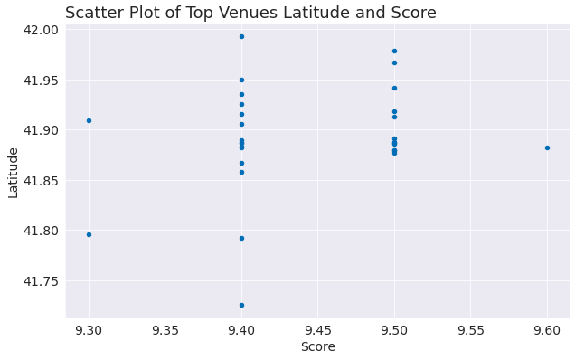


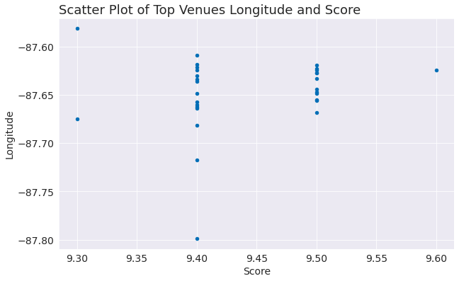

Although nothing obvious to would appear that the top venues are centered arounf the `-87.65` Longitude.

the Restaurant data was examined next.

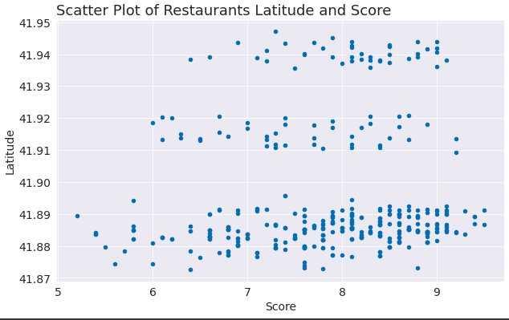

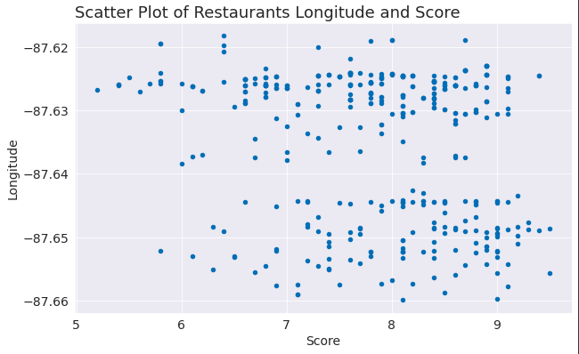

Unsuprisingly the Restaurant data is also clustered arounf the  `-87.65` Longitude given that Restaurants with 500 meters of the top venues were selected.


## Further Visualisation

Because it was not possible, because of the categorical nature of the data, to do more details inferential statistical analysis of the data further exploratory visualisation was undertaken. It shouldbe noted, however, that this visualisation would actually become part of the final presentation to the traveller. It would be important for the traveller to see the crime, venue and restaurant data presented in this manner.

###Display each of the Top 10 Venues

In this section a preview of the type of data that will be displayed to a user of the proposed solution is shown.

For each of the Top 10 Venues:

1. All crimes within 750 meters of the venue are added to a dataframe
2. All restaurants associated with the venue are added to a dataframe
3. A folium Map is created centered on the venue
4. A heatmap of the crimes in the area are overlayed
5. the venue is marked on the map
6. The top 10 scored restaurants are marked on the map

It is possible to fully automate this through full iteration but in order to clearly show each of the 10 maps each is generated manually (to a degree).

A couple of example of the generated maps are shown below. 

The first map below is the top rated venue _Millennium Park_. The location of the attraction and the 10 top rated venues are clearly shown. The Top Venue is shown using a blue marker, the restaurants are shown using a red marker. Also shown is the heatmap of cimes within 750 meters over the course of the entire previous year. The hotter, redder, the heatmap the more crimes there are recorded. Some Restaurants, for example the one located at the top left of the map, appear to be in areas where crime is quite frequent. On the other hand others are in areas which are obviously not as crime ridden.

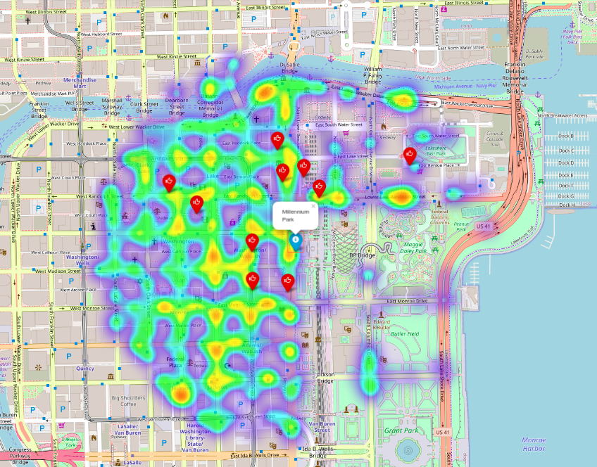


The second map is for _Grant Park_. It is immediately apparent that the crime rate in this area of the city is much lower:

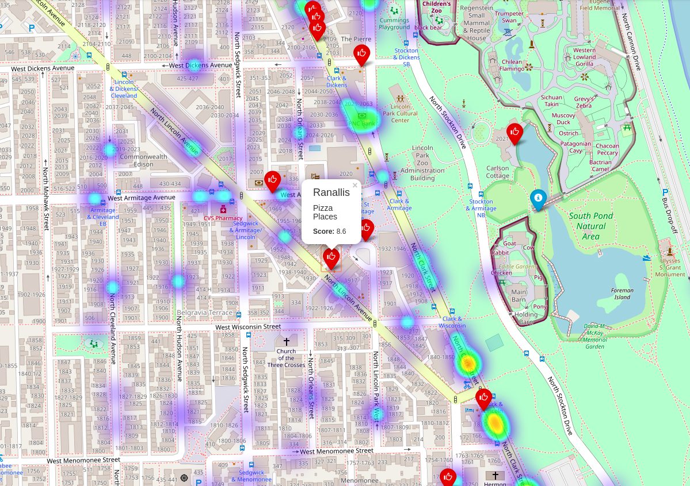

Visiting this venue appears to be a much safer option with very little crime recored in the immediate vicinity. Also shown in the map above is the extra details provided about each Restaurant. The restaurant name, *Ranallis*, it's food type _Pizza Places_, and its average score are given.

## Modelling

Before we start modelling we need to prepare the data frame to include only mumerical data and by removing unneeded columns.

Rather than removing colums from `df_crimes` a new `df_features` DataFrame was created with just the required columns. This `df_features` DataFrame was then processed to remove Categorical Data Types and replace them with One Hot encoding. Finally the Dependant Variables were Normalised.

The Features DataFrame looked like this:

`df_features.head()`

| latitude  | longitude  | hour_0 | hour_1 | hour_2 | hour_3 | hour_4 | hour_5 | hour_6 | hour_7 | ...  | January | July | June | March | May  | November | October | September | ward | crimes    |
| --------- | ---------- | ------ | ------ | ------ | ------ | ------ | ------ | ------ | ------ | ---- | ------- | ---- | ---- | ----- | ---- | -------- | ------- | --------- | ---- | --------- |
| 41.707001 | -87.636288 | 0      | 0      | 0      | 0      | 0      | 0      | 0      | 0      | ...  | 0       | 0    | 0    | 0     | 0    | 0        | 0       | 0         | 9.0  | ASSAULT   |
| 41.777468 | -87.615556 | 1      | 0      | 0      | 0      | 0      | 0      | 0      | 0      | ...  | 0       | 0    | 0    | 0     | 0    | 0        | 0       | 0         | 20.0 | ASSAULT   |
| 41.847566 | -87.645749 | 0      | 0      | 1      | 0      | 0      | 0      | 0      | 0      | ...  | 0       | 0    | 0    | 0     | 0    | 0        | 0       | 0         | 11.0 | DECEPTIVE |
| 41.773046 | -87.571599 | 0      | 0      | 0      | 0      | 0      | 0      | 0      | 0      | ...  | 0       | 0    | 0    | 0     | 0    | 0        | 0       | 0         | 5.0  | MOTOR     |
| 41.909759 | -87.736078 | 0      | 0      | 0      | 0      | 0      | 0      | 0      | 0      | ...  | 0       | 0    | 0    | 0     | 0    | 0        | 0       | 0         | 26.0 | ASSAULT   |

5 rows × 47 columns

`df_featues.dtypes`

```python
latitude     float64
longitude    float64
hour_0         uint8
hour_1         uint8
hour_2         uint8
hour_3         uint8
hour_4         uint8
hour_5         uint8
hour_6         uint8
hour_7         uint8
hour_8         uint8
hour_9         uint8
hour_10        uint8
hour_11        uint8
hour_12        uint8
hour_13        uint8
hour_14        uint8
hour_15        uint8
hour_16        uint8
hour_17        uint8
hour_18        uint8
hour_19        uint8
hour_20        uint8
hour_21        uint8
hour_22        uint8
hour_23        uint8
Friday         uint8
Monday         uint8
Saturday       uint8
Sunday         uint8
Thursday       uint8
Tuesday        uint8
Wednesday      uint8
April          uint8
August         uint8
December       uint8
February       uint8
January        uint8
July           uint8
June           uint8
March          uint8
May            uint8
November       uint8
October        uint8
September      uint8
ward         float64
crimes        object
dtype: object
```


Five model type were then chosen to be evaluated:

1. K Nearest Neighbours
2. Decision Trees
3. Logestic Regression
4. Naive Bayes
5. Decision Forest using a Random Forest

There was one significant issue with the crimes data frame as acquired. Although multiclass classification / prediction is possible, the crimes dataset is unbalanced. Modelling algorithms work best when there is approximately an equal number of samples for each class for example [The Curse of Class Imbalance](https://www.google.com/url?sa=t&rct=j&q=&esrc=s&source=web&cd=1&cad=rja&uact=8&ved=2ahUKEwjrqamF2YbeAhWkK8AKHXTjBhwQFjAAegQICRAC&url=https%3A%2F%2Feprint.iacr.org%2F2018%2F476.pdf&usg=AOvVaw35P8S6qqW4iZXU35rzUR5u) and [Class imbalance and the curse of minority hubs](https://www.sciencedirect.com/science/article/abs/pii/S0950705113002682).

For this reason the modelling task was turned into a simple binary classification task by only modelling based on the top two most occuring crimes. For each model development 10 Fold Cross Validation was used to ensure the best results were achieved and a Grid Search approach was used to determine the best setting for each of the models:

###K Nearest Neighbours

K Nearest Neighbor(KNN) is a very simple, easy to understand, versatile and one of the topmost machine learning algorithms. KNN is used in the variety of applications such as finance, healthcare, political science, handwriting detection, image recognition and video recognition. KNN algorithm is used for both classification and regression problems.

KNN Model was quick to execute and through the process of evaluation it was discovered the `K = 11` gave the best results

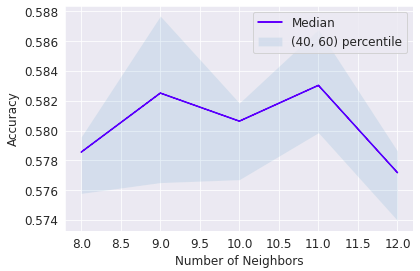

KNN was not particularly fast taking approximately 11 minutes per model.

```
Heighbours:  8   2020-07-13 05:14:46.106230
Heighbours:  9   2020-07-13 05:25:00.446760
Heighbours:  10   2020-07-13 05:35:19.462282
Heighbours:  11   2020-07-13 05:46:31.035670
Heighbours:  12   2020-07-13 05:58:16.281600
```

### Decision Tree

A decision tree is a decision support tool that uses a tree-like graph or model of decisions and their possible consequences, including chance event outcomes, resource costs, and utility.

The Decision Tree model was particularly fast taking only 12 seconds per model. This meant that it was easy to try multiple different parameters. A tree depth of 15 gave the best model performance:


### Logistic Regression & Naive Bayes

Logistic Regression and Naive Bayes models did not return any models with an accuracy greater that 0.6119 and 0.6038.

### Decision Forest using a Random Forest

**Random forests** or **random decision forests** are an ensemble learning method for classification, regression and other tasks, that operate by constructing a multitude of decision trees at training time and outputting the class that is the mode of the classes (classification) or mean prediction (regression) of the individual trees. Random decision forests correct for decision trees' habit of overfitting to their training set.

Each model took approximately 35 seconds to create and 21 estimators was found to give the best model accuracy.

```
Estimator:  20   2020-07-13 06:14:08.934891
Estimator:  21   2020-07-13 06:14:41.426336
Estimator:  22   2020-07-13 06:15:15.543834
Estimator:  23   2020-07-13 06:15:50.992585
```

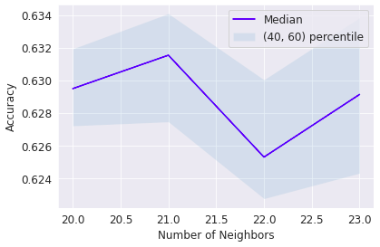

### Best Model

Using the the crime data for the top two occuring crimes each of the top performing models where further evaluated to to determine which model performed the best using F1-Score, Jaccard Score and Log Loss.

Randon forest was determined to be the best model.

| Algorithm             | F1-Score | Jaccard  | LogLoss   |
| --------------------- | -------- | -------- | --------- |
| KNN                   | 0.681585 | 0.699357 | 10.997775 |
| Decision Tree         | 0.704909 | 0.706291 | 10.192168 |
| Bernoulli Naive Bayes | 0.603178 | 0.649608 | 13.705928 |
| Logistic Regression   | 0.614712 | 0.663373 | 13.307555 |
| Random Forest         | 0.995419 | 0.995731 | 0.158221  |


## Best Model- Detailed Examination

Ramdom Forest is the best model scoring highest in all measurements, F1-Score, Jaccard and Log Loss. Let's now create a new model. The September crime data will become the unseen test data for the final model.

The Top Two Crimes Feature Features Dataframe was created again and split into Training Data, everything except December, and Test Data, July.

### Predict the Final Performance of the Model

The F1-Score and Jaccard Score were calculated

```
# Predict yhat using X_Test
yhat = Forest_model_final.predict(X_Test)
    
# Measure the Jaccard Score of the final Model
jaccard_final = metrics.jaccard_similarity_score(y_Test, yhat)
print('Jaccard Score', jaccard_final)
    
f1 = metrics.f1_score(y_Test, yhat, average=None)
print('F1-Score of each class', f1)
```

```
Jaccard Score 0.6240198101527032
F1-Score of each class [0.58124569 0.65886538]
```

### What are the important Features

The most important, or informative, features were then determined. The top ten are shown:

```python
Feature ranking:
1. feature 0 (0.268107)
2. feature 1 (0.253966)
3. feature 45 (0.123830)
4. feature 32 (0.013686)
5. feature 31 (0.013682)
6. feature 26 (0.013433)
7. feature 27 (0.013411)
8. feature 38 (0.012438)
9. feature 34 (0.012358)
10. feature 30 (0.012206)
```

This shows that the most predictive models are:

1. Latitude
2. Longitude
3. Ward

After these the day and the month of the crime are weak predicters at ~1.1%. The other features, particulraly the hour the crime took place, are hardly predictive at all. A plot of this is shown below:

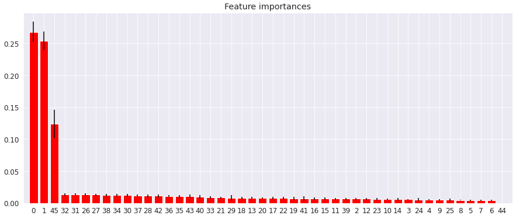

## Results & Prediction

Let's review the goals of this project.

The idea for the Capstone Project is to show that when driven by venue and location data from FourSquare, backed up with open source crime data, that it is possible to present the cautious and nervous traveller with a list of attractions to visit supplementd with a graphics showing the occurance of crime in the region of the venue.

A high level approach is as follows:

- [x] The travellers decides on a city location [in this case Chicago]
- [x] The ForeSquare website is scrapped for the top venues in the city
- [x] From this list of top venues the list is augmented with additional grographical data
- [x] Using this additional geographical data the top nearby restaurents are selects
- [x] The historical crime within a predetermined distance of all venues are obtained
- [x] A map is presented to the to the traveller showing the selected venues and crime statistics of the area. 
- [ ] The future prediction of a crime happening near or around the selected top sites is also presented to the user

So all goals have been achieved except the final one. In this Results and Predictions Section this goal is addressed.

The purpose of this project was to see if crime can be predicted. However, the nature of the dataset, particularly the number of different crimes and the unbalanced nature of the dataset, makes it difficult to predict what crime will predict and when. We can, however, repurpose the Crimes DataFrame by spliting the dataset into two distinct balanced sets and randonly assigning to `0` to represent no crime and `1` to present a crime happening. The data set looked like this:

| latitude  | longitude  | hour_0 | hour_1 | hour_2 | hour_3 | hour_4 | hour_5 | hour_6 | hour_7 | ...  | July | June | March | May  | November | October | September | random_crimes |
| --------- | ---------- | ------ | ------ | ------ | ------ | ------ | ------ | ------ | ------ | ---- | ---- | ---- | ----- | ---- | -------- | ------- | --------- | ------------- |
| 41.707001 | -87.636288 | 0      | 0      | 0      | 0      | 0      | 0      | 0      | 0      | ...  | 0    | 0    | 0     | 0    | 0        | 0       | 0         | 1             |
| 41.777468 | -87.615556 | 1      | 0      | 0      | 0      | 0      | 0      | 0      | 0      | ...  | 0    | 0    | 0     | 1    | 0        | 0       | 0         | 1             |
| 41.847566 | -87.645749 | 0      | 0      | 1      | 0      | 0      | 0      | 0      | 0      | ...  | 0    | 0    | 0     | 1    | 0        | 0       | 0         | 0             |
| 41.773046 | -87.571599 | 0      | 0      | 0      | 0      | 0      | 0      | 0      | 0      | ...  | 0    | 0    | 0     | 0    | 0        | 0       | 0         | 0             |
| 41.909759 | -87.736078 | 0      | 0      | 0      | 0      | 0      | 0      | 0      | 0      | ...  | 0    | 0    | 0     | 1    | 0        | 0       | 0         | 0             |

5 rows × 46 columns

The differnce between this and earlier modelling is that the `Ward` attribute had to be removed for reason which will become obvious presently.

### Test Data

The test data was contructed from the the Top Venues Data Frame and the Restaurants Dataframe as follows:

1. The two dataframes were joined together to form a single dataframe. The venue or restaurant name and the latitude and longitude attributes were added.
2. Duplicate entries were dropped as some restaurants appeared multiple times in the dataframe
3. Next a random date and time was assigned to each venue.
4. The date was then split into Hour, Day of Week, Month and Year as described above
5. The data was finally prepared for prediction by applying One Hot encoding and then extracted into a new dataframe that match the format used to create the model.
6. y^ (y_hat) or the predictions were then made


The results of the predistions areshown below

`yhat`

```python
array([0, 0, 1, 0, 1, 0, 1, 0, 0, 1, 0, 0, 0, 0, 0, 0, 1, 0, 0, 1, 0, 0,
       0, 0, 0, 1, 1, 1, 0, 0, 0, 0, 0, 0, 0, 0, 0, 0, 0, 0, 1, 1, 0, 0,
       0, 0, 0, 0, 1, 0, 0, 0, 0, 0, 1, 0, 0, 1, 1, 0, 0, 0, 0, 0, 0, 0,
       1, 0, 0, 0, 0, 0, 1, 0, 0, 1, 0, 0, 0, 0, 1, 1, 0, 0, 0, 0, 1, 0,
       0, 1, 0, 0, 0, 0, 0, 0, 0, 0, 0, 0, 0, 0, 0, 0, 0, 0, 0, 0, 0, 0,
       1, 0, 0, 1, 1, 0, 0, 0, 0, 0, 0, 0, 0, 0, 0, 1, 0, 0, 0, 0, 0, 1,
       1, 0, 0, 0, 0, 0, 1, 0, 1, 0, 0, 0, 0, 0, 0, 0, 0, 0, 1, 0, 0, 0,
       0, 0, 0, 0, 1, 0, 0, 0, 0, 0, 0, 0, 1, 0, 0, 0, 0, 0, 1, 0, 0, 1,
       0, 0, 0, 1, 1, 0, 0, 0, 0, 0, 0, 1, 0, 0, 0, 1, 0, 0, 0, 0, 0, 0,
       0, 1, 0, 0, 0, 1, 0, 0, 0, 0, 0, 0, 0, 1, 0, 0, 0, 1, 0, 0, 0, 0,
       0, 1, 0, 0, 0, 0, 0, 0, 0, 0, 1, 0, 0, 1, 0, 0, 0, 0, 0, 0, 0, 0])
```

And the Predictions were readded to the data (as it was before One Hot encoding was applied).

In total 46 location were predicted as potentially safe locations to visit (19%) and 196 were classified as potentially susceptible to crime (81%).

`df_final.head(10)`

| name                                         | latitude  | longitude  | date                | prediction |
| -------------------------------------------- | --------- | ---------- | ------------------- | ---------- |
| Millennium Park                              | 41.882598 | -87.624126 | 2020-12-18 15:23:00 | 0          |
| Chicago Riverwalk                            | 41.887280 | -87.627217 | 2020-11-24 09:41:00 | 0          |
| Binny's Beverage Depot                       | 41.913076 | -87.655170 | 2020-08-12 09:52:00 | 1          |
| Nature Boardwalk                             | 41.918102 | -87.633283 | 2020-03-17 00:16:00 | 0          |
| Chicago Lakefront Trail                      | 41.967053 | -87.646909 | 2020-09-09 07:29:00 | 1          |
| Grant Park                                   | 41.876626 | -87.619263 | 2020-11-12 17:43:00 | 0          |
| The Art Institute of Chicago                 | 41.879689 | -87.623258 | 2020-11-17 07:47:00 | 1          |
| The Chicago Theatre                          | 41.885539 | -87.627151 | 2020-10-06 13:13:00 | 0          |
| Unabridged Books                             | 41.941588 | -87.644386 | 2020-08-15 20:16:00 | 0          |
| Symphony Center (Chicago Symphony Orchestra) | 41.879275 | -87.624680 | 2020-09-10 05:44:00 | 1          |

## Visualisation of Predictions

Of the top ten venues 4 were identified as potentially dangerous to visit and 6 were deems safe. As there is no data to compare the predictions against the best way we will visualise the data again.

We will look at the following 4 venues:
1. `Millennium Park 41.882699 -87.623644`
1. `Chicago Riverwalk 41.887280 -87.627217`
1. `Binny's Beverage Depot 41.913076 -87.655170`
1. `Chicago Lakefront Trail 41.967053 -87.646909`


The Distance Dataframe is recreated again but this time all crimes are included.

The first two images are are of Millennium Park and of Chicago Riverwalk. Both of these venues were identified as likely to be susceptible to crime.


The next images are from Binny's Beverage Depot and Chicago Lakefront Trail. Both don't show signs of criminal activity

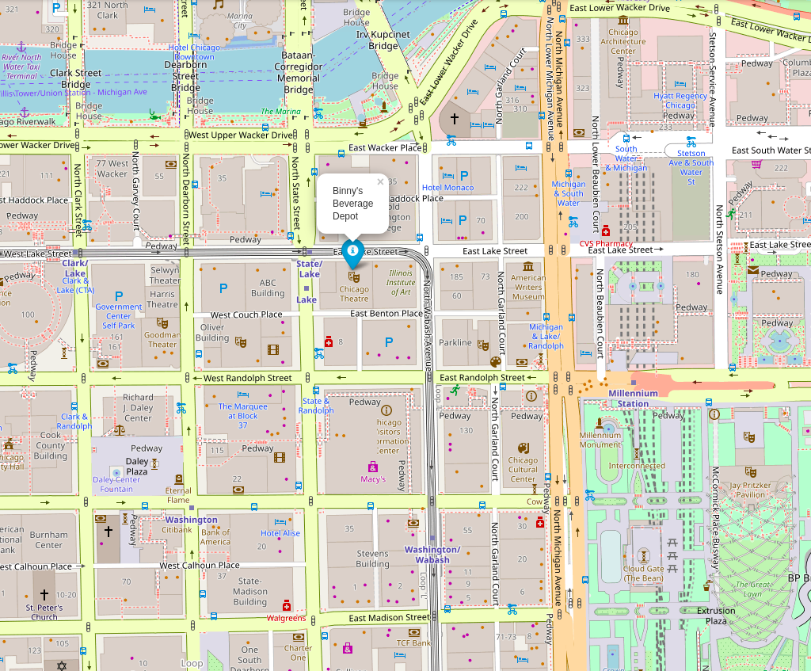

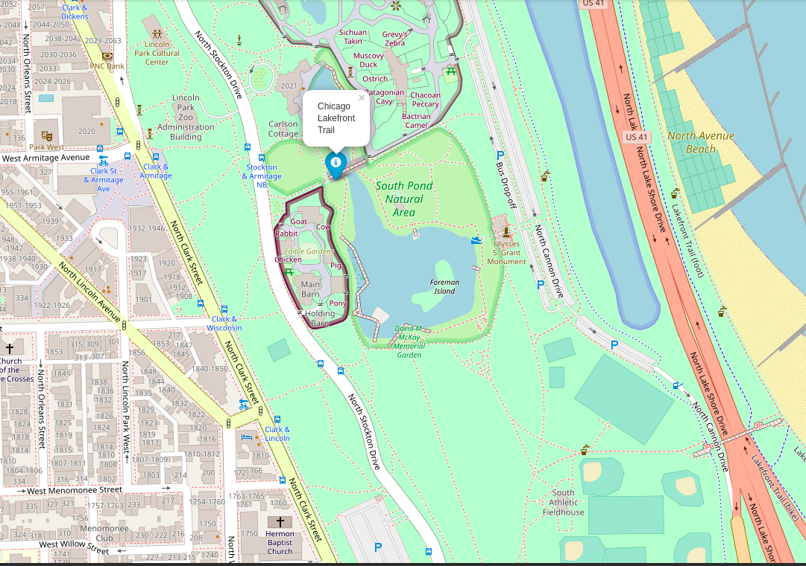


# Conclusions and Discussions

Although all of the goals of this project were met there is definitely room for further improvement and development as noted below. However, the goals of the project were met and, with some more work, could easily be devleoped into a fully phledged application that could support the cautious traveller in an unknown location.

Of the contributing data the Chicago Crime data is the one where more data would be good to have. Also not every city in the world makes this data freely available so that is a drawback.

FourSquare proved to be a good source of data but frustrating at times. Despite having a Developer account I regularly exceeded my hourly limit locking me out for the day. This is why Pickle was used to store the captured data. 


# Further Development

The following are suggestions how this project could b efurther developed:

1. Best time to visit each venue
2. Suggestions for morning, afternoon, evening and night time

3. Daily itineraries

4. Route planning and transportation

5. Time lapse of the crime in the area of the venue

6. Favourite dining preferences could be used to choose the restaurants

# References

[1] [Forsquare API](https://developer.foursquare.com/)

[2] [K-nearest Neighbors algorithm](https://en.wikipedia.org/wiki/K-nearest_neighbors_algorithm)

[3] [Decision Tree algorithm](https://towardsdatascience.com/how-to-visualize-a-decision-tree-from-a-random-forest-in-python-using-scikit-learn-38ad2d75f21c)

[4] [Logistic Regression algorithm](https://machinelearningmastery.com/logistic-regression-for-machine-learning/)

[5] [Random Forest](https://towardsdatascience.com/random-forest-in-python-24d0893d51c0)

[6] [Bernoulli Naive Bayes](https://en.wikipedia.org/wiki/Naive_Bayes_classifier)

# Github

All source for this project is available on Github.

https://github.com/Vanh1112/final_project_Capstone

# Google Colab

All source for this project is available on Google Colab.

https://drive.google.com/drive/folders/17i3m4lh_OMjeXEKkFIESUCuI3PQTo36K?usp=sharing

# Blogpost

https://anhpham1112.blogspot.com/2020/07/the-battle-of-neighborhoods.html


